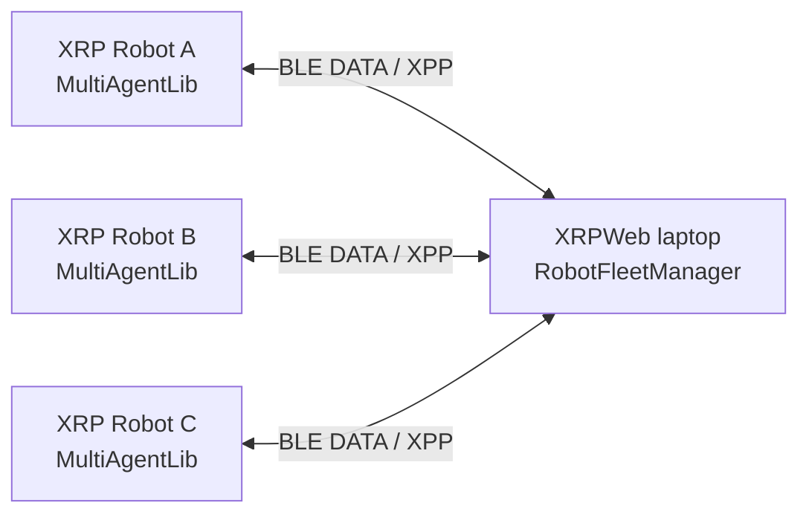
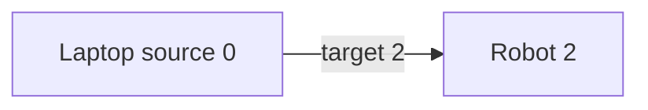
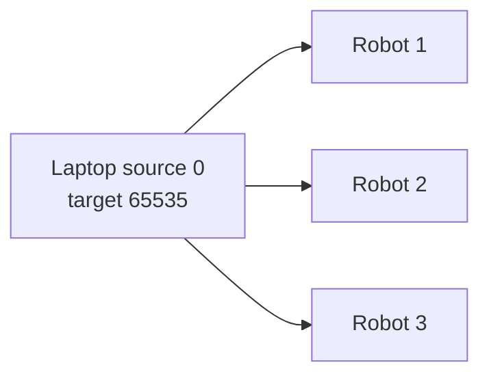
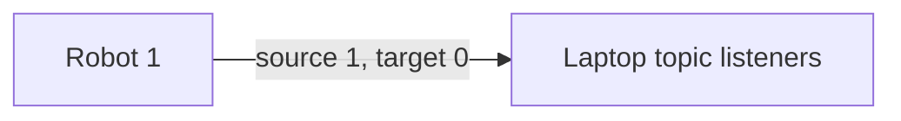
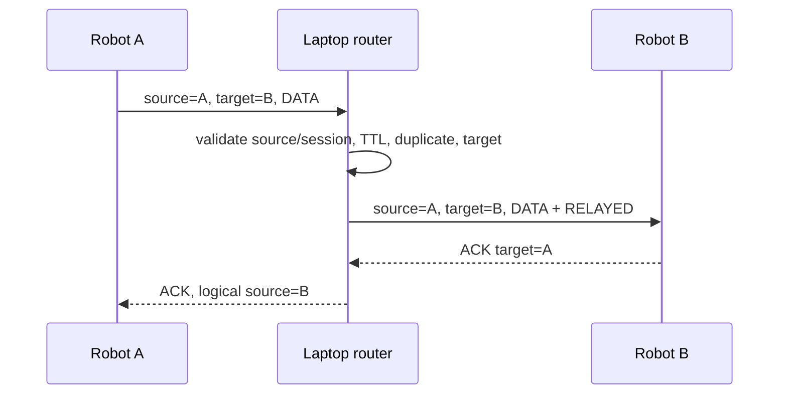

# Multi-Agent Architecture

## Design

The first production topology is a centralized local star. Bluetooth Low Energy is the physical
transport, XPP is the outer framing protocol, MultiAgentLib is the general robot protocol/API, and
RobotFleetManager is the laptop coordinator/router. No Wi-Fi, Internet service, cloud server,
WebSocket backend, or external broker is used.

## Required routes

Laptop to one robot:

Laptop broadcast creates one independently scheduled copy per ready session:

Robot to laptop:

Logical robot-to-robot relay:

## Component ownership

Every `RobotSession` owns its transport, parser, sequence counter, scheduler, reconnect state, metrics,
capabilities, and identity. Every scheduler owns its high-priority queue, reliable queue, latest-only
map, normal bounded queue, in-flight write, and pending ACK timers. No parser or write queue is global.

`RobotFleetManager` owns the session map, routing-ID map, bounded duplicate history, topic listeners,
bounded routing log, heartbeats, RTT tracking, aliases, and preferred ID persistence.

## Identity and handshake

The coordinator is ID 0; 1–65533 are assigned robots; 65534 is unassigned; 65535 is broadcast.
After the robot program explicitly starts `MultiAgentNode`, it sends HELLO. The laptop assigns a RAM
routing ID and sends HELLO_ACK. A session is not ready until this exchange completes. Preferred IDs and
aliases are persisted in browser storage against the hardware identity reported by the robot; no robot
filesystem write is required.

Inbound source IDs are checked against the physical session. A ready robot packet whose source differs
from the session's assigned ID is rejected as impersonation.

## IDE compatibility boundary

Fleet runtime does not replace `AppMgr.getConnection()` and never redirects an ordinary single-robot
IDE command. For team programs, `BluetoothIDETransport` attaches `RobotFleetManager` to the dedicated
DATA characteristics of an already-open Bluetooth IDE session without opening another GATT connection.
`USBIDETransport` wraps XPP multi-agent frames in an ASCII-safe hexadecimal envelope on the already-open
Web Serial stream; those frames are decoded and separated from normal terminal output. Both transports participate in the same laptop router, so USB-only
and mixed USB/Bluetooth teams use the same student-facing API. Neither adapter takes ownership of the
physical disconnect/reconnect lifecycle. Bluetooth terminal and filesystem traffic remain on the REPL
UART while its multi-agent packets remain on DATA; USB safely multiplexes both over Web Serial. The manual
DATA-only chooser is retained for runtime experiments.

## Extension points

Topic codecs sit outside the router. Unknown topics remain opaque bytes. Strategy code can consume
future AprilTag pose/ball observations and publish only per-robot commands. The generic core has no
EmotionLib, RoboCup strategy, camera, or Blockly dependency.
